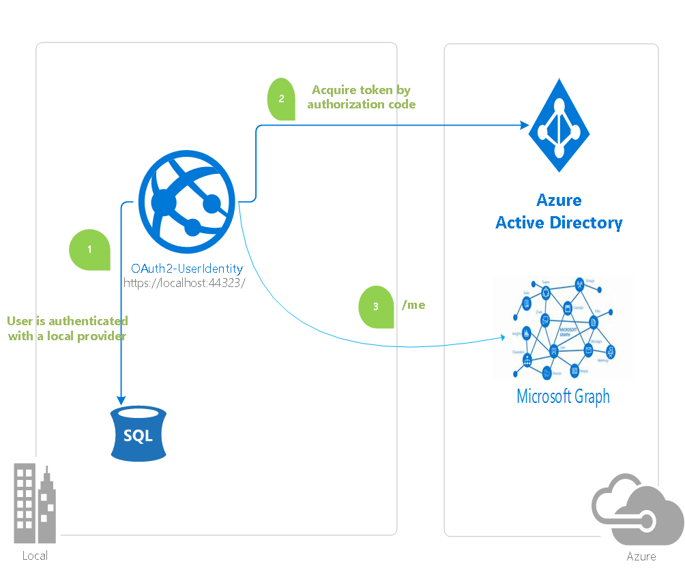

# Calling Azure AD protected web APIs in a web app using OAuth 2.0


> You might also be interested in this sample: https://github.com/Azure-Samples/ms-identity-aspnetcore-webapp-tutorial
>
> This newer sample takes advantage of the Microsoft identity platform (formerly Azure AD v2.0).
>
> While still in public preview, every component is supported in production environments.

## About this sample

### Overview

In the sample, an existing web app with its own way of signing in users adds the ability to call an Azure AD protected web API, in this case the Graph API.  This sample uses the [OAuth 2.0 authorization code grant with confidential client] (https://docs.microsoft.com/en-us/azure/active-directory/develop/v1-protocols-oauth-code) and the Active Directory Authentication Library (ADAL) to obtain access tokens for the user signed into th web app to call the Graph API with the user's identity.

This sample is useful if you want to add the capability to call an Azure protected Web API to an existing application. One example couldbe an application that authenticates Azure AD users using Windows Identity Foundation and WS-Federation or a user authentiated using ADFS.

If you want to build a new web application that signs users in using Azure AD as well as calling web APIs protected using Azure AD, check out the [active-directory-dotnet-webapp-webapi-openidconnect](https://github.com/Azure-Samples/active-directory-dotnet-webapp-webapi-openidconnect) sample instead.  OpenIDConnect provides a more efficient way to get access tokens for a user to call a web API, by obtaining an authorization code for the user at the time they sign in.  This also means your application can skip having logic for sending OAuth authorization requests and processing responses.

For more information about how the protocols work in this scenario and other scenarios, see [Authentication Scenarios for Azure AD](http://go.microsoft.com/fwlink/?LinkId=394414).



> Looking for previous versions of this code sample? Check out the tags on the [releases](../../releases) GitHub page.

## How to run this sample

To run this sample, you'll need:

- [Visual Studio 2017](https://aka.ms/vsdownload)
- An Internet connection
- An Azure Active Directory (Azure AD) tenant. For more information on how to get an Azure AD tenant, see [How to get an Azure AD tenant](https://azure.microsoft.com/en-us/documentation/articles/active-directory-howto-tenant/)
- A user account in your Azure AD tenant. This sample will not work with a Microsoft account (formerly Windows Live account). Therefore, if you signed in to the [Azure portal](https://portal.azure.com) with a Microsoft account and have never created a user account in your directory before, you need to do that now.

### Step 1:  Clone or download this repository

From your shell or command line:

```Shell
git clone https://github.com/Azure-Samples/active-directory-dotnet-webapp-webapi-oauth2-useridentity.git
```

or download and extract the repository .zip file.

> Given that the name of the sample is pretty long, and so are the name of the referenced NuGet packages, you might want to clone it in a folder close to the root of your hard drive, to avoid file size limitations on Windows.

### Step 2:  Register the sample with your Azure Active Directory tenant

There is one project in this sample. To register it, you can:

- either follow the steps in the paragraphs below ([Step 2](#step-2--register-the-sample-with-your-azure-active-directory-tenant) and [Step 3](#step-3--configure-the-sample-to-use-your-azure-ad-tenant))
- or use PowerShell scripts that:
  - **automatically** create for you the Azure AD applications and related objects (passwords, permissions, dependencies)
  - modify the Visual Studio projects' configuration files.

If you want to use this automation, read the instructions in [App Creation Scripts](./AppCreationScripts/AppCreationScripts.md)

#### Choose the Azure AD tenant where you want to create your applications

As a first step you'll need to:

1. Sign in to the [Azure portal](https://portal.azure.com) using either a work or school account or a personal Microsoft account.
1. If your account is present in more than one Azure AD tenant, select `Directory + Subscription` at the top right corner in the menu on top of the page, and switch your portal session to the desired Azure AD tenant.   
1. In the left-hand navigation pane, select the **Azure Active Directory** service, and then select **App registrations (Preview)**.

#### Register the service app (OAuth2-UserIdentity)

1. In **App registrations (Preview)** page, select **New registration**.
1. When the **Register an application page** appears, enter your application's registration information:
   - In the **Name** section, enter a meaningful application name that will be displayed to users of the app, for example `OAuth2-UserIdentity`.
   - In the **Supported account types** section, select **Accounts in any organizational directory and personal Microsoft accounts (e.g. Skype, Xbox, Outlook.com)**.
   - In the Redirect URI (optional) section, select **Web** in the combo-box and enter the following redirect URIs.
       - `https://localhost:44323/`
       - `https://localhost:44323/OAuth`
    > Note that if there are more than one redirect URIs, you'd need to add them from the **Authentication** tab later after the app has been created succesfully. 
1. Select **Register** to create the application.
1. On the app **Overview** page, find the **Application (client) ID** and **Directory (tenant) ID** values and record them for later. You'll need them to configure the Visual Studio configuration file for this project.
1. In the list of pages for the app, select **Authentication**.
   - In the **Advanced settings** section set **Logout URL** to `https://localhost:44323/Account/LogOff`
   - In the **Advanced settings** | **Implicit grant** section, check **Access tokens** and **ID tokens** as this sample requires 
   the [Implicit grant flow](https://docs.microsoft.com/en-us/azure/active-directory/develop/v2-oauth2-implicit-grant-flow)to be enabled to
   sign-in the user, and call an API.
1. Select **Save**.
1. From the **Certificates & secrets** page, in the **Client secrets** section, choose **New client secret**:

   - Type a key description (of instance `app secret`),
   - Select a key duration of either **In 1 year**, **In 2 years**, or **Never Expires**.
   - When you press the **Add** button, the key value will be displayed, copy, and save the value in a safe location.
   - You'll need this key later to configure the project in Visual Studio. This key value will not be displayed again, nor retrievable by any other means,
     so record it as soon as it is visible from the Azure portal.
1. In the list of pages for the app, select **API permissions**
   - Click the **Add a permission** button and then,
   - Ensure that the **Microsoft APIs** tab is selected
   - In the *Commonly used Microsoft APIs* section, click on **Microsoft Graph**
   - In the **Delegated permissions** section, ensure that the right permissions are checked: **User.Read**. Use the search box if necessary.
   - Select the **Add permissions** button

### Step 3:  Configure the sample to use your Azure AD tenant

In the steps below, "ClientID" is the same as "Application ID" or "AppId".

Open the solution in Visual Studio to configure the projects

#### Configure the service project

1. Open the `OAuth2-UserIdentity\Web.Config` file
1. Find the app key `ida:ClientId` and replace the existing value with the application ID (clientId) of the `OAuth2-UserIdentity` application copied from the Azure portal.
1. Find the app key `ida:AppKey` and replace the existing value with the key you saved during the creation of the `OAuth2-UserIdentity` app, in the Azure portal.
1. Find the app key `ida:Tenant` and replace the existing value with your Azure AD tenant name.

### Step 4: Run the sample

Clean the solution, rebuild the solution, and run it.

Explore the sample by

1. Click on the **Register** link on the top menu to register a local account with the application.
1. Use the the **Log in** link then to sign-in using that local account.
1. Thereafter, click on the **Profile** link to open  the Profile page. If you are not signed in to Azure AD, use the link provided at the bottom to link an AAD user's account and seeing their profile information.
1. Sign out from the application, and starting again.

## How to deploy this sample to Azure

This project has one WebApp / Web API projects. To deploy them to Azure Web Sites, you'll need, for each one, to:

- create an Azure Web Site
- publish the Web App / Web APIs to the web site, and
- update its client(s) to call the web site instead of IIS Express.

### Create and publish the `OAuth2-UserIdentity` to an Azure Web Site

1. Sign in to the [Azure portal](https://portal.azure.com).
1. Click `Create a resource` in the top left-hand corner, select **Web** --> **Web App**, and give your web site a name, for example, `OAuth2-UserIdentity-contoso.azurewebsites.net`.
1. Thereafter select the `Subscription`, `Resource Group`, `App service plan and Location`. `OS` will be **Windows** and `Publish` will be **Code**.
1. Click `Create` and wait for the App Service to be created.
1. Once you get the `Deployment succeeded` notification, then click on `Go to resource` to navigate to the newly created App service.
1. The following steps provide instructions to create a Sql database that the sample needs. If you already have a Sql Server and database present and a connection string available, skip the steps till we ask you to provide the connections string in the `Application Settings`.
1. Click `Create a resource` in the top left-hand corner again, select **Databases** --> **SQL Database**, to create a new database. Follow the `Quickstart tutorial` if needed.
1. You can name the Sql server and database whatever you want to.
1. Select or create a database server, and enter server login credentials. Carefully note down the username and password for the Sql server as you'll need it when constructing your Sql conenction string later.
1. Wait for the `Deployment succeeded` notification, then click on `Go to resource` to navigate to the newly created database's manage screen.
1. Click on **Connection Strings** on left menu and copy the **ADO.NET (SQL authentication)** connection string. Populate  **User ID={your_username};Password={your_password};** with values your provided during database creation.Copy this connection string.
1. Once the web site is created, locate it it in the **Dashboard** and click it to open **App Services** **Overview** screen.
1. Click on **Application settings** in the left menu of the App service and add the copied Sql connection string in the **Connection strings** section as `DefaultConnection`.
1. Choose `SQLAzure` in the **Type** dropdown. **Save** the setting.
1. From the **Overview** tab of the App Service, download the publish profile by clicking the **Get publish profile** link and save it.  Other deployment mechanisms, such as from source control, can also be used.
1. Switch to Visual Studio and go to the OAuth2-UserIdentity project.  Right click on the project in the Solution Explorer and select **Publish**.  Click **Import Profile** on the bottom bar, and import the publish profile that you downloaded earlier.
1. Click on **Configure** and in the `Connection tab`, update the Destination URL so that it is a `https` in the home page url, for example [https://OAuth2-UserIdentity-contoso.azurewebsites.net](https://OAuth2-UserIdentity-contoso.azurewebsites.net). Click **Next**.
1. On the Settings tab, make sure `Enable Organizational Authentication` is NOT selected.  Click **Save**. Click on **Publish** on the main screen.
1. Visual Studio will publish the project and automatically open a browser to the URL of the project.  If you see the default web page of the project, the publication was successful.

### Update the Active Directory tenant application registration for `OAuth2-UserIdentity`

1. Navigate back to to the [Azure portal](https://portal.azure.com).
In the left-hand navigation pane, select the **Azure Active Directory** service, and then select **App registrations (Preview)**.
1. In the resultant screen, select the `OAuth2-UserIdentity` application.
1. In the **Authentication** | page for your application, update the Logout URL fields with the address of your service, for example [https://OAuth2-UserIdentity-contoso.azurewebsites.net](https://OAuth2-UserIdentity-contoso.azurewebsites.net)
1. From the *Branding* menu, update the **Home page URL**, to the address of your service, for example [https://OAuth2-UserIdentity-contoso.azurewebsites.net](https://OAuth2-UserIdentity-contoso.azurewebsites.net). Save the configuration.
1. Add the same URL in the list of values of the *Authentication -> Redirect URIs* menu. If you have multiple redirect urls, make sure that there a new entry using the App service's Uri for each redirect url.

## How To Recreate This Sample

1. In Visual Studio 2017, create a new ASP.Net MVC web application with Authentication set to `Individual User Accounts`.
1. Set SSL Enabled to be True.  Note the SSL URL.
1. In the project properties, Web properties, set the Project Url to be the SSL URL.
1. Add the latest [Active Directory Authentication Library NuGet] (`Microsoft.IdentityModel.Clients.ActiveDirectory`).
1. In the `Models` folder add a new class called `UserProfile.cs`.  Copy the implementation of `UserProfile` from this sample into the class.
1. Add a new empty MVC5 controller `UserProfileController` to the project.  Copy the implementation of the controller from the sample.  Remember to include the [Authorize] attribute on the class definition.
1. In `Views` --> `UserProfile` create a new view, `Index.cshtml`, and copy the implementation from this sample.
1. In the shared `_Layout` view, add the Action Link for Profile that is in the sample.
1. Add a new empty MVC5 controller `OAuthController` to the project.  Copy the implementation of the controller from the sample.
1. In AccountController's LogOff() method, copy the code which clears the token cache.
1. In `web.config`, in `<appSettings>`, create keys for `ida:ClientId`, `ida:AppKey`, `ida:AADInstance`, `ida:Tenant`, `ida:GraphResourceId`, and `ida:GraphUserUrl` and set the values accordingly.  For the public Azure AD, the value of `ida:AADInstance` is `https://login.microsoftonline.com/{0}` the value of `ida:GraphResourceId` is `https://graph.microsoft.com`, and the value of `ida:GraphUserUrl` is `https://graph.microsoft.com/me`.
1. In `web.config` add this line in the `<system.web>` section: `<sessionState timeout="525600" />`.  This increases the ASP.Net session state timeout to it's maximum value so that access tokens and refresh tokens cache in session state aren't cleared after the default timeout of 20 minutes.

## Community Help and Support

Use [Stack Overflow](http://stackoverflow.com/questions/tagged/msal) to get support from the community.
Ask your questions on Stack Overflow first and browse existing issues to see if someone has asked your question before.
Make sure that your questions or comments are tagged with [`adal` `msal` `dotnet`].

If you find a bug in the sample, please raise the issue on [GitHub Issues](../../issues).

To provide a recommendation, visit the following [User Voice page](https://feedback.azure.com/forums/169401-azure-active-directory).

## Contributing

If you'd like to contribute to this sample, see [CONTRIBUTING.MD](/CONTRIBUTING.md).

This project has adopted the [Microsoft Open Source Code of Conduct](https://opensource.microsoft.com/codeofconduct/). For more information, see the [Code of Conduct FAQ](https://opensource.microsoft.com/codeofconduct/faq/) or contact [opencode@microsoft.com](mailto:opencode@microsoft.com) with any additional questions or comments.

## More information

For more information, see the following links:

- [Quickstart: Register an application with the Microsoft identity platform (Preview)](https://docs.microsoft.com/azure/active-directory/develop/quickstart-register-app)
- [Quickstart: Configure a client application to access web APIs (Preview)](https://docs.microsoft.com/azure/active-directory/develop/quickstart-configure-app-access-web-apis)
- [Recommended pattern to acquire a token](https://github.com/AzureAD/azure-activedirectory-library-for-dotnet/wiki/AcquireTokenSilentAsync-using-a-cached-token#recommended-pattern-to-acquire-a-token)
- [Customizing Token cache serialization](https://github.com/AzureAD/azure-activedirectory-library-for-dotnet/wiki/Token-cache-serialization)
- [Understanding Azure AD application consent experiences](https://docs.microsoft.com/en-us/azure/active-directory/develop/application-consent-experience)
- [Customizing Token cache serialization](https://github.com/AzureAD/azure-activedirectory-library-for-dotnet/wiki/Token-cache-serialization)
- [ADAL.NET's conceptual documentation](https://github.com/AzureAD/azure-activedirectory-library-for-dotnet/wiki)

For more information about how OAuth 2.0 protocols work in this scenario and other scenarios, see [Authentication Scenarios for Azure AD](http://go.microsoft.com/fwlink/?LinkId=394414).
